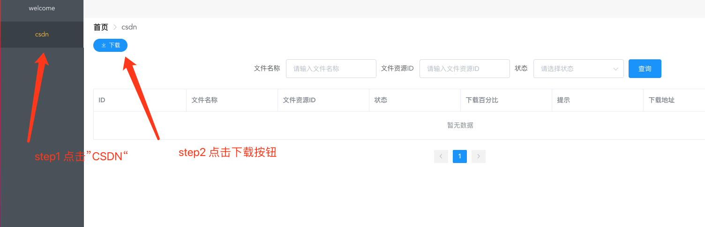
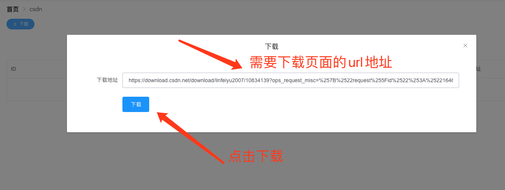
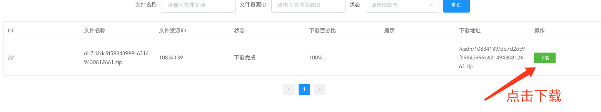

# csdn资源下载工具

#### 介绍
+ csdn免积分下载工具
+ csdn免会员下载工具
+ csdnvip资源下载工具

#### 软件架构
采用spingboot + dubbo 架构设计 

#### 安装教程

1.  体验地址 http://toolman.ddnsfree.com:8181/#/login?c=12
2.  需要注册 并拥有qq,163等邮箱

#### 使用说明

1. 复制需要下载页面的url(也即是浏览器地址栏的地址)

2. 张贴到下载输入框的

3. 点击下载

#### 参与贡献

1.  Fork 本仓库
2.  新建 Feat_xxx 分支
3.  提交代码
4.  新建 Pull Request

